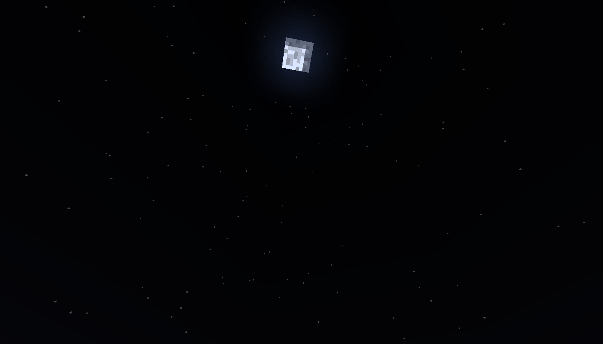

# cs189-minecraft-astronomy
Given a Minecraft player's pitch and yaw and the current Minecraft tick, we aim to predict the position of the sun and moon in the player's field of view. Team members: Nick Mecklenburg, Poojan Shukla, Daron Assadourian

## Data Collection
First, we needed to build a dataset. Below is a sample screenshot from Minecraft gameplay with a player yaw and pitch of 100 and -60, respectively, at tick 18240.

Using basic computer vision techniques (i.e. thresholding, finding contours and image moments), we identify the centroid of the observed celestial body, which in this case would be the moon. We use this information to output a row to our dataset csv, with the input information (yaw, pitch, tick) and output information (X coordinate of the sun, Y coordinate of the sun, X coordinate of the moon, Y coordinate of the moon). We treat the top left of the image as the origin with down and right being the positive directions of the y and x axes, respectively. Finally, if the moon or sun is not visible, we say its coordinates are at (0, 0).

A player's pitch value falls in [-180, 180), their yaw value is in \[-90, 90\], and a Minecraft day has 24,000 ticks, which we zero index in our analysis. If we were to take a screenshot at every combination of integer values for pitch, yaw, and tick, we'd need 1,563,840,000 images. If we estimate that ~three seconds is needed to capture each image (which we found to be true from experimentation after taking game lag and png writing time into account), this would take over a million hours to complete. Obviously, this is impractical, but we wouldn't need so much data given the anticipated simplicity of the model in the first place, so we reduce the scale. Specifically, we take a screenshot at every combination of yaw value between -180 and 160 (inclusive) at intervals of 20, pitch value between -90 and 30 (inclusive) at intervals of 15, and tick value between 0 and 24,000 (inclusive) at intervals of 240. This gives us a total of 16,200 images, and we can furthermore say in advance that for the same ranges of yaw and tick values, the sun and moon coordinates will be the zero tuple for pitch values between 45 and 90 (inclusive) again spaced at intervals of 15. (This is because the sky is out of sight at these angles.) Including these zero-tuples, our total dataset now has a size of 23,400 rows.

We automated the screenshot collection process with a simple VBS script executed on a windows laptop; this is provided in the data folder along with a notebook that performs the necessary image analysis work to take the image and write a row of celestial body coordinates to a csv. We also include a zipped folder of 1,620 sample images that we gathered when working on this as well as the final dataset that we used for training. Note that this project was done using default Minecraft view settings (e.g. FOV is "Normal"), with the exception of turning off cloud rendering to avoid being unable to see the sun.

## Data Analysis and Prediction
Our data is very sparse and we hypothesized that the relationships were nonlinear. We indeed found that basic linear regression and related models (e.g. LASSO) performed quite poorly. We used a strawman model that always predicted zero (which was correct on the majority of our data due to the sparsity of the dataset) as a good baseline for our analysis. We found that a decision-tree-based approach (namely using random forests) performed the best on the data, and we are not surprised by this given the branched nature of the code we had to write to analyze the images and build the dataset in the first place. This analysis can be found in the [prediction notebook](./prediction.ipynb).